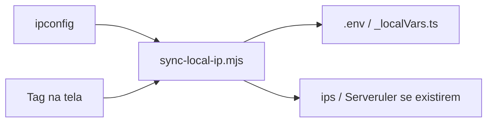

# sync-local-ip

Seu IP local muda. Seus `.env` não acompanham — até agora.

**sync-local-ip** descobre o IPv4 útil desta máquina no Windows e grava esse endereço nos arquivos locais dos seus clones. Sem abrir terminal. Sem editar dezenas de arquivos à mão.

Qualquer pasta em `scanRoots` recebe o IP novo em `.env`, `.env.local` e `_localVars.ts`. Se existirem `ips/table.ts`, `data.json` ou o redirect do Serveruler, esses arquivos também são atualizados.

## O que ele faz

1. Lê o `ipconfig` e escolhe o IPv4 certo (Ethernet ou Wi-Fi; ignora WSL, VirtualBox e similares).
2. Classifica o perfil pela faixa do IP: **empresa** (`10.10.0.x`) ou **casa** (`172.24.x` / `10.20.x` / `192.168.x`).
3. Propaga esse IP nos arquivos configurados — envs em qualquer clone, e, quando presentes, tabela de IPs e redirect do Serveruler.
4. Mostra o resultado numa faixa no canto da tela (a **tag**): verde quando está alinhado, vermelho quando não.



A ferramenta só lê a rede e grava arquivos no disco. Não sobe servidores, não altera a placa de rede e não envia dados para fora.

## Começar em 5 minutos

Requisitos: Windows 10/11 e [Node.js](https://nodejs.org/) 20+ no `PATH`.

```powershell
git clone https://github.com/RafaelHDSV/sync-local-ip.git
cd sync-local-ip
copy config.example.json config.json
```

Edite o `config.json`:

```json
{
  "userKey": "seu-login",
  "reposRoot": "C:\\caminho\\para\\seus\\clones",
  "scanRoots": [
    "C:\\caminho\\para\\seus\\clones",
    "D:\\outro\\projeto"
  ]
}
```

- `userKey` — identificador seu (a mesma chave em `ips/table.ts`, se você usar essa tabela).
- `reposRoot` — pasta âncora dos clones (detalhes em [configuração](docs/configuracao.md)).
- `scanRoots` — onde varrer `.env` e `_localVars.ts`. Pode listar **qualquer** repositório.

Ensaio sem gravar, depois sync de verdade:

```powershell
node sync-local-ip.mjs --dry-run
node sync-local-ip.mjs
```

Suba a tag (sem janela de terminal):

```powershell
wscript.exe .\sync-local-ip-startup.vbs
```

Para abrir no logon: `.\install-startup.ps1`. Remover: `.\uninstall-startup.ps1`.

Clique na tag = sincronizar agora. Verde = IP nos arquivos bate com a máquina. Vermelho = passe o mouse no tooltip.

## Documentação

| Doc | Conteúdo |
|-----|----------|
| [Configuração](docs/configuracao.md) | `config.json`, caminhos, `userKey`, vários discos |
| [Rede e arquivos](docs/rede-e-arquivos.md) | Perfis empresa/casa, o que é gravado, como o IP é escolhido |
| [Tag](docs/tag.md) | Cores, cliques, logon, `ui-state.json` |
| [Linha de comando](docs/linha-de-comando.md) | Flags do `.mjs` e do `.ps1` |
| [Problemas comuns](docs/problemas-comuns.md) | Sintoma → causa → ação |
| [Especificação](docs/especificacao.md) | Contrato do produto |
| [DESIGN](docs/DESIGN.md) | Visual da tag |
| [Contribuir](CONTRIBUTING.md) | Testes e pull request |

## Licença

MIT — veja [LICENSE](LICENSE).
