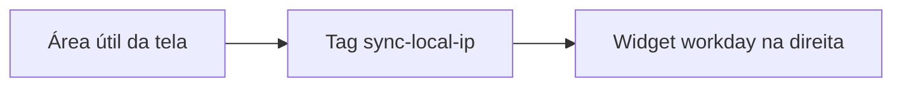

# DESIGN — tag do sync-local-ip

> **Para que serve:** aparência e comportamento visual da faixa de IP. O código da tag deriva daqui.
> **Fonte da verdade:** `sync-local-ip-tag.ps1`.
> **Relacionados:** [especificacao.md](especificacao.md), [README.md](../README.md).

Atualizado em 2026-09-29.

## Direção

**Tese:** uma faixa de status no canto da área de trabalho, no mesmo espírito do widget de workday: legível de relance, sem janela e sem competir com o editor.

| Campo | Valor |
|-------|-------|
| Quem usa | Quem desenvolve nos clones AGX, no Windows, o dia inteiro |
| Função da UI | Dizer se o IP detectado já está gravado nos arquivos, e oferecer sync, mover, esconder e sair |
| Tom | Técnico, quieto, denso. O IP é o conteúdo; não há título nem ícone de produto |

## O que isto não é

- Não é página, dashboard nem componente shadcn.
- Não usa Inter, Roboto nem paleta roxa de SaaS.
- Não tem hero, cartão, formulário nem modo claro. A faixa é sempre escura, porque fica sobre qualquer janela.
- Não aparece na barra de tarefas e não rouba foco (`ShowInTaskbar` falso, `ShowActivated` falso).

## Cor

Valores como estão no XAML implícito do PowerShell (canal alfa `FF`).

| Papel | Hex | Quando |
|-------|-----|--------|
| Fundo da faixa | `#2D2D30` | sempre |
| Texto em repouso, antes do primeiro check | `#E8E8E8` | só no primeiro frame (`IP ...` ainda sem resultado) |
| Sincronizando | `#F2C94C` | texto `IP ...` enquanto o Node roda |
| Alinhado | `#6FCF97` | IP e `✓` |
| Divergente ou erro com IP conhecido | `#EB5757` | IP e `✗` |
| Sem IP utilizável | `#9E9E9E` | `sem IP` ou `erro (passe o mouse)` |

Não há token CSS. Quem alterar uma cor altera o `ConvertFromString` correspondente em `sync-local-ip-tag.ps1` e esta tabela no mesmo turno.

Não há modo claro. A faixa não inverte com o tema do Windows.

## Tipografia

| Papel | Família | Tamanho | Uso |
|-------|---------|---------|-----|
| Único | Segoe UI | 12 px | IP, marca de status, mensagens curtas de erro |

Sem display, sem mono separado. O endereço usa a mesma fonte do resto para a faixa continuar estreita. Não há import de fonte: Segoe UI já está no Windows.

## Espaçamento e raio

| Token | Valor |
|-------|-------|
| Raio da faixa | 4 px |
| Padding horizontal | 8 px |
| Padding vertical | 2 px |
| Densidade | compacta, uma linha só |

A janela tem `SizeToContent` largura e altura. Não há layout interno além do `TextBlock`.

## Posição

A faixa nasce no canto inferior da área útil da tela, deslocada 340 px para a esquerda da borda direita (`trayOffsetPx`) e com margem inferior -35 px (`marginBottom`), de propósito à esquerda do widget de workday.

Arrastar recalcula esses dois números a partir dessa área e grava em `ui-state.json`. Um timer de 5 segundos reaplica a posição, para a faixa não ficar órfã se a barra de tarefas ou o monitor mudar. Ela permanece `TOPMOST`.

## Comportamento visível

| Momento | O que a pessoa vê |
|---------|-------------------|
| Abertura | `IP ...` amarelo, depois o resultado do sync |
| Clique sem arrastar | volta ao amarelo e em seguida ao verde ou ao vermelho |
| Arrastar | a faixa segue o ponteiro; soltar grava a posição |
| Duplo clique | some até a meia-noite local |
| Tooltip | só quando há `error` no JSON do Node; no vermelho com IP, o motivo está aí |
| Cursor | mão, sobre a faixa inteira |

Não há animação de entrada, hover colorido nem transição. `prefers-reduced-motion` não se aplica: não há motion para reduzir.

O menu de contexto (clique direito) tem três itens, nesta ordem: Sincronizar agora, Abrir pasta, Sair.

## Mapa no código

| Artefato | Onde |
|----------|------|
| Cores, fonte, padding, raio, menu | `sync-local-ip-tag.ps1` |
| Posição e ocultar até | `ui-state.json` (gerado na máquina, não versionado) |
| Lançamento sem console | `sync-local-ip-startup.vbs` |

## Changelog

| Data | Mudança |
|------|---------|
| 2026-09-29 | Primeira versão alinhada à tag WPF que já está no repositório |
