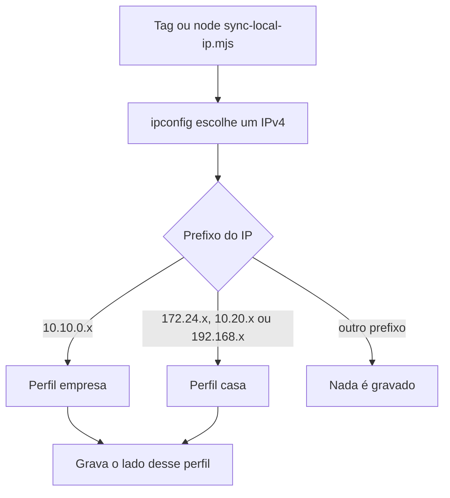

# Rede e arquivos

> **Para que serve:** perfis empresa/casa, o que é gravado e como o IP é escolhido.
> **Fonte da verdade:** `lib/network-profile.mjs`, `lib/detect-ip.mjs`, `sync-local-ip.mjs`.
> **Relacionados:** [configuracao.md](configuracao.md), [tag.md](tag.md), [especificacao.md](especificacao.md).

## Perfis

O perfil sai do IP que o `ipconfig` escolheu. IP de casa nunca vai para o campo `empresa`, e o contrário também não.

| IP detectado | Perfil | Campo em `ips/table.ts` / `data.json` (se existirem) | Constante no redirect (se existir) |
|--------------|--------|------------------------------------------------------|-------------------------------------|
| `10.10.0.x` | empresa | `empresa` | `COMPANY_IP_ADDRESS` |
| `172.24.x.x` | casa | `casa` | `HOME_IP_ADDRESS` |
| `10.20.x.x` | casa | `casa` | `HOME_IP_ADDRESS` |
| `192.168.x.x` (LAN doméstica) | casa | `casa` | `HOME_IP_ADDRESS` |

Fora desses prefixos (4G, hotspot `10.x`, IPv6) não há sincronização. A tag fica vermelha até voltar a uma rede com um desses prefixos. Qualquer `192.168.x` conta como casa, inclusive o Wi-Fi de um hotel.

Com ZeroTier (`172.24.x`) e LAN (`192.168.x`) ativos ao mesmo tempo, o ZeroTier ganha: é o endereço que os outros devs alcançam. Se o `casa` virar um `192.168.x`, ele só é alcançável de dentro daquela rede doméstica.

Essas faixas vieram do ambiente AGX (escritório + ZeroTier de casa). Em outro time, o mesmo mecanismo serve se o IP local cair numa delas; prefixos novos ainda não são configuráveis pelo JSON.

## O que a varredura troca nos `.env`

Em qualquer perfil, primeiro os IPs que a ferramenta **já gravou nesta máquina**: o `ip` e os `previousIps` de `.last-ip.json`, **de qualquer perfil**. Ao trocar de rede, o IP que está nos `.env` é justamente o da outra rede. Por isso esse histórico não é filtrado por perfil.

Somam-se a eles:

- Na rede empresa: qualquer `10.10.0.x` diferente do detectado, e também o IP de `casa` cadastrado na sua linha da tabela (se houver tabela).
- Na rede casa: qualquer `172.24.x` / `10.20.x` diferente do detectado, e também o IP de `empresa` da tabela.

Um `192.168.x` que a ferramenta não conhece não é mexido. A varredura por prefixo não inclui `192.168`, porque trocaria o `vEthernet` do Hyper-V, IPs de Docker e aparelhos da LAN.

A troca é do **texto do número**, em qualquer lugar do arquivo. Não há lista de nomes de variável. Se um `.env` dentro de `scanRoots` tiver o `10.10.0.x` de outra pessoa, esse número vira o seu na rede empresa. Não aponte `scanRoots` para pastas de exemplo ou de outro login se esses arquivos não devem seguir o seu IP.

## Arquivos atualizados

### Em cada pasta de `scanRoots` (inclui `reposRoot`)

Busca recursiva. Ignora `node_modules`, `.git`, `dist`, `build`, `.next`, `coverage`, `.turbo`, `vendor`, `.cache` e `.vercel`.

| Arquivo | O que acontece |
|---------|----------------|
| `.env` e `.env.local` | Substitui pelo detectado os IPs antigos desta máquina (histórico de qualquer perfil), os do prefixo do perfil atual e o IP da outra rede da tabela, se houver |
| `_localVars.ts` | Idem |

Não entram: `.env.development`, `.env.production`, `.env.test` e qualquer outro nome. Se o IP do app estiver só nesses, a tag pode ficar verde e o app continuar no IP velho.

### Só em `reposRoot` (pulados se ausentes)

| Arquivo | Empresa | Casa |
|---------|---------|------|
| `ips/table.ts` | `empresa` da sua chave | `casa` da sua chave |
| `serveruler-client/public/data.json` | idem | idem |
| `serveruler-redirect/index.html` | `COMPANY_IP_ADDRESS` → `http://SEU_IP:5173/` | `HOME_IP_ADDRESS` no mesmo formato |

Porta **5173** fixa na URL do redirect. A ferramenta não sobe o Serveruler.

Cópia irmã: se existir `serveruler-redirect` ao lado desta ferramenta, o `index.html` dela também é atualizado (ex.: `.tools/sync-local-ip` + `.tools/serveruler-redirect`).

Arquivo ausente → `skip` no log, não é criado. Campo `casa` vazio → pulado.

## Como o IP é escolhido

`ipconfig` completo. Fora da disputa: WSL, `vEthernet`, Hyper-V, VirtualBox, VMware, Docker, Bluetooth, loopback, `Local Area Connection*`, nomes com `#`, e IPs `127.*` / `169.254.*` / `26.*` (Radmin VPN) / `25.*` (Hamachi). O Radmin aparece como `Ethernet N`, sem o nome da VPN, por isso o filtro é pela faixa de IP.

Pontuação entre o que sobra:

- gateway `10.10.0.1` ou `172.24.0.1`: prioridade alta. O gateway é lido mesmo quando vem depois do IPv4, ou numa linha de continuação abaixo do IPv6 (Windows em português)
- IP no prefixo empresa ou ZeroTier casa (`172.24` / `10.20`): bônus. `192.168` não ganha esse bônus
- Ethernet acima de Wi-Fi

Só adaptador virtual → sem IP → tag `sem IP`. IPv6 não entra.

## Estado `.last-ip.json`

Escrito só após sync real (não em `--dry-run` nem `--check-only`): IP, perfil (`company` / `home`), até 12 IPs anteriores, adaptador, data. O histórico guarda IPs de qualquer perfil e alimenta a próxima troca de rede (veja [O que a varredura troca nos `.env`](#o-que-a-varredura-troca-nos-env)).
